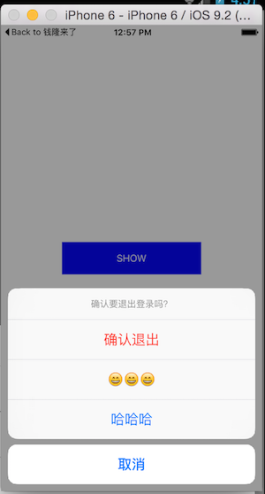
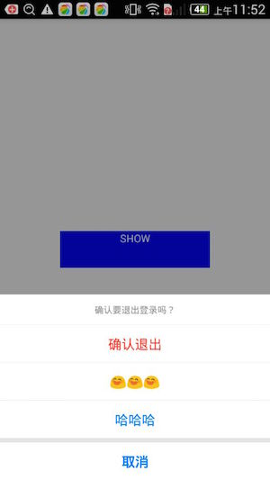

# react-native-actionsheet
Cross platform ActionSheet. This component implements a custom ActionSheet  and provides the same way to drawing it on the defferent platforms(iOS and Android). Actually, In order to keep the best effect, it still uses the ActionSheetIOS on iOS.

 

# Installation

```
npm i react-native-actionsheet --save
```

## Usage

```javascript
import React from 'react'
import { View, Text, StyleSheet, Modal, ListView } from 'react-native'
import ActionSheet from 'react-native-actionsheet'

const CANCEL_INDEX = 0
const DESTRUCTIVE_INDEX = 4
const options = [ 'Cancel', 'Apple', 'Banana', 'Watermelon', 'Durian' ]
const title = 'Which one do you like?'

class ExampleA extends React.Component {
  constructor(props) {
    super(props)
    this.state = {
      selected: ''
    }
    this.handlePress = this.handlePress.bind(this)
    this.showActionSheet = this.showActionSheet.bind(this)
  }

  showActionSheet() {
    this.ActionSheet.show()
  }

  handlePress(i) {
    this.setState({
      selected: i
    })
  }

  render() {
    return (
      <View style={styles.wrapper}>
        <Text style={{marginBottom: 20}} >I like {options[this.state.selected]}</Text>
        <Text style={styles.button} onPress={this.showActionSheet}>Example A</Text>
        <ActionSheet
          ref={o => this.ActionSheet = o}
          title={title}
          options={options}
          cancelButtonIndex={CANCEL_INDEX}
          destructiveButtonIndex={DESTRUCTIVE_INDEX}
          onPress={this.handlePress}
        />
      </View>
    )
  }
}
```


## Use ActionSheetCustom directly

so you can customize option and title

```javascript
import React from 'react'
import { View, Text, StyleSheet, Modal, ListView } from 'react-native'
import { ActionSheetCustom as ActionSheet } from 'react-native-actionsheet'

const CANCEL_INDEX = 0
const DESTRUCTIVE_INDEX = 4

const options = [ 
  'Cancel', 
  'Apple', 
  <Text style={{color: 'yellow'}}>Banana</Text>,
  'Watermelon', 
  <Text style={{color: 'red'}}>Durian</Text>
]

const title = <Text style={{color: '#000', fontSize: 18}}>Which one do you like?</Text>

class ExampleB extends React.Component {
  constructor(props) {
    super(props)
    this.state = {
      selected: ''
    }
    this.handlePress = this.handlePress.bind(this)
    this.showActionSheet = this.showActionSheet.bind(this)
  }

  showActionSheet() {
    this.ActionSheet.show()
  }

  handlePress(i) {
    this.setState({
      selected: i
    })
  }

  render() {
    return (
      <View style={styles.wrapper}>
        <Text style={{marginBottom: 20}} >I like {options[this.state.selected]}</Text>
        <Text style={styles.button} onPress={this.showActionSheet}>Example B</Text>
        <ActionSheet
          ref={o => this.ActionSheet = o}
          title={title}
          options={options}
          cancelButtonIndex={CANCEL_INDEX}
          destructiveButtonIndex={DESTRUCTIVE_INDEX}
          onPress={this.handlePress}
        />
      </View>
    )
  }
}
```

## Props

<table>
    <tr>
        <th>Prop name</th>
        <th>Desciption</th>
        <th>Type</th>
        <th>Default</th>
    </tr>
    <tr>
        <td>title</td>
        <td></td>
        <td>PropTypes.string or PropTypes.element</td>
        <td></td>
    </tr>
    <tr>
        <td>message</td>
        <td></td>
        <td>PropTypes.string or PropTypes.element</td>
        <td></td>
    </tr>
    <tr>
        <td>options</td>
        <td></td>
        <td>PropTypes.arrayOf([PropTypes.string, PropTypes.element])</td>
        <td></td>
    </tr>
    <tr>
        <td>tintColor</td>
        <td></td>
        <td>PropTypes.string</td>
        <td></td>
    </tr>
    <tr>
        <td>cancelButtonIndex</td>
        <td></td>
        <td>PropTypes.number</td>
        <td></td>
    </tr>
    <tr>
        <td>destructiveButtonIndex</td>
        <td></td>
        <td>PropTypes.number</td>
        <td></td>
    </tr>
    <tr>
        <td>onPress</td>
        <td></td>
        <td>PropTypes.func</td>
        <td>(index) => {}</td>
    </tr>
</table>
